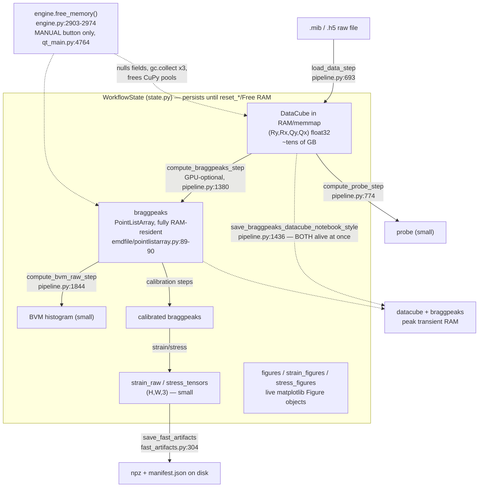
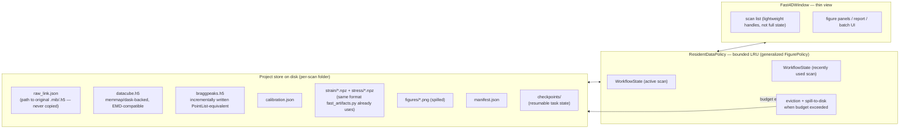
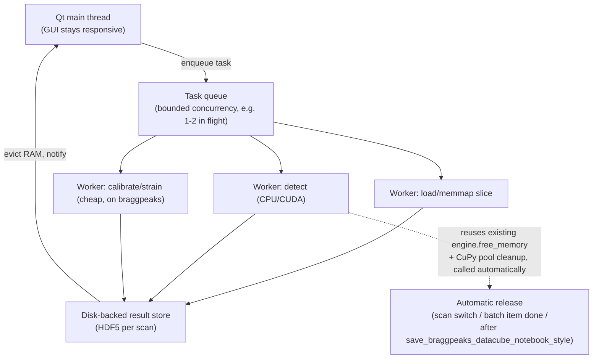

# Fast4D Memory Optimization & Out-of-Core Architecture Report

**Date:** 2026-07-09
**Scope:** Full-codebase memory investigation of Fast4D (PySide6 GUI + py4DSTEM 0.14.19 pipeline), evaluated against out-of-core architecture options.
**Method:** Static analysis of the Fast4D codebase (`engine.py`, `pipeline.py`, `driver.py`, `state.py`, `qt_main.py`, `qt_widgets.py`, `qt_report.py`, `fast_batch.py`, `batch_common.py`, `fast_artifacts.py`, `analysis.py`, `stress_analysis.py`, `batch_figures.py`, `drift_estimate.py`) and of the installed `py4DSTEM==0.14.19` package source (`C:\Users\jtapiaca.ASURITE\.conda\envs\py4dstem-01419\Lib\site-packages\py4DSTEM`). All claims below are grounded in `file:line` citations found by direct inspection; anything not confirmed is explicitly flagged as such rather than assumed.

---

## Executive summary

Fast4D's memory profile is dominated by exactly one object class: the raw 4D `DataCube` (`Ry × Rx × Qy × Qx`, float32), which the codebase itself documents as **"tens of GB" per scan** (`engine.py:2903` docstring) and, for a 512×512×256×256 acquisition, **~32 GB** (`pipeline.py:332`). Everything downstream of Bragg-disk detection — calibration, BVM histograms, strain, stress, line profiles — operates on objects that are 3-4 orders of magnitude smaller (2D/3D real-space maps, peak lists). This means the memory problem is narrower than "the whole pipeline is heavy": **it is specifically about how long the raw DataCube (and, secondarily, the raw `BraggVectors`/`PointListArray`) stay resident, and how many of them can be resident at once.**

The good news: Fast4D already has real, working infrastructure for exactly this problem — a size-based memmap heuristic (`_pick_mib_mem_mode`, `pipeline.py:328`), a full manual memory-release routine with GPU pool cleanup (`engine.free_memory`, `engine.py:2903-2974`), and a proven LRU-with-disk-spill pattern for figures (`FigurePolicy`, `engine.py:975-1178`, cap of 12 in RAM). The core finding of this report is that **none of this is applied automatically or uniformly** — it exists as manual, opt-in, or figure-only machinery, while the same pattern is not extended to the datacube, braggpeaks, or multi-scan batch state. The highest-leverage work is therefore *generalizing infrastructure that already exists*, not building new infrastructure from scratch.

The second finding: py4DSTEM 0.14.19 itself has **no lazy/chunked/zarr support in its own native `.h5` format or shared I/O layer (`emdfile`)** — reading a py4DSTEM-native file is always fully eager (`emdfile/classes/array.py:569`). Lazy/memmap access exists only for *raw instrument formats* (MIB, EMPAD, Gatan DM, K2) at import time. This caps how far Fast4D can go without either patching `emdfile`/`py4DSTEM` (upstream, higher risk) or building a Fast4D-side ingestion/streaming layer around the existing per-position iteration that `find_Bragg_disks` and `get_origin` already do internally (lower risk, contained to Fast4D's own code).

---

## Part I — Analysis of the Current Workflow

### 1.1 Data loading path

- Entry point: `load_data_step` (`pipeline.py:693`) → tries a light `.h5` sidecar of only virtual images first (`_load_visualcube_from_h5`, via `_default_sidecar_h5_path`, `pipeline.py:165`), then unconditionally calls `_load_raw_datacube` (`pipeline.py:556`), which dispatches to `_load_mib` (`pipeline.py:435`), `.npy`/`.npz` loaders, or `_load_emd_h5_datacube` (`pipeline.py:228`, via `_candidate_datapaths`/`_load_datacube_root`, `pipeline.py:594-622`).
- **No chunking of the DataCube exists in Fast4D's own code.** The closest thing to streaming is memmap: `.npy` files use `np.load(mmap_mode="r")` (`pipeline.py:583`); `.mib` loading uses `_pick_mib_mem_mode` (`pipeline.py:328`), a heuristic that picks `"memmap"` over `"RAM"` when the file is ≥6 GiB on disk **or** >40% of available RAM (checked via `psutil`). Even in "memmap" mode, every full-scan operation still touches every frame — I/O cost is amortized, not truly reduced.
- Size class, confirmed by an existing code comment: **"Large 4D cubes (e.g. 512×512×256×256) are ~32GB as float32"** (`pipeline.py:332`). Shape pattern is `(Ry, Rx, Qy, Qx)`.
- `load_data_step` calls `state.reset_data_products()` (`state.py:157`, sets `datacube = None`) before loading a new cube, so **only one raw datacube is resident per `WorkflowState` at a time** — the old one is dropped (not necessarily immediately reclaimed by the allocator) before the new one loads.

### 1.2 Which downstream steps actually need the full DataCube

| Step | Needs full DataCube? | Evidence |
|---|---|---|
| `compute_probe_step` / `compute_probe_from_bf_vacuum_roi_step` | Yes | `datacube.get_vacuum_probe(ROI=...)` (`pipeline.py:774, 858`) |
| `detect_selected_bragg_disks_step` (6-point preview) | No — only 6 positions | `pipeline.py:1344`; effectively chunk-friendly already |
| `compute_braggpeaks_step` (full detection) | Yes, for the scan duration | `state.datacube.find_Bragg_disks(...)` (`pipeline.py:1380`); GPU path logged `1403-1411` |
| `compute_bvm_raw_step` | **No** — operates on `state.braggpeaks` | `pipeline.py:1844`, `get_bvm_raw`/`histogram(mode="raw")` |
| Calibration (origin/ellipse/Q-pixel) | **No** — operates on braggpeaks/BVM | e.g. `run_origin_correction_step` (`pipeline.py:1894`), `calibrate_q_pixel_size_si_step` (`pipeline.py:2227`) |
| Strain/stress | **No** — operates on braggpeaks | see Part IV; `StrainMap` never touches the raw cube |
| `save_braggpeaks_datacube_notebook_style` | Yes, by design | re-saves datacube **and** braggpeaks together (`pipeline.py:1436`, `py4DSTEM.save(path, dc, ...)`) — the one place both must be alive simultaneously |

**Conclusion:** the raw DataCube is only strictly required for two steps (probe, full disk detection) plus one save operation. Everything after disk detection runs on the compact `BraggVectors`/derived-array layer — which is exactly why calibration/strain/stress/batch stages are cheap (see 1.4).

### 1.3 Full copies and intermediate objects

- `_detach_braggpeaks_for_export` (`pipeline.py:1547`) explicitly documents avoiding `deepcopy`, preferring `cut_from_tree()`/`copy()` — a conscious anti-duplication choice already in the code.
- `fast_artifacts.py`: `save_fast_artifacts` (`fast_artifacts.py:304`) writes only small scan-grid arrays (`strain_raw_{label}.npz` shape `(H,W,3)`, `adf_realspace.npz` shape `(H,W)`, `stress_tensors_*.npz`) via `np.savez_compressed`, plus a JSON manifest (`build_manifest`, `fast_artifacts.py:240`). `load_fast_artifacts` (`fast_artifacts.py:476`) uses proper `with np.load(...) as d:` blocks (lines 505, 517, 535) that close handles correctly. **No full DataCube is ever saved/loaded here.**
- `WorkflowState` (`state.py`) holds, per scan: `datacube`, `visualcube`, `vacuumcube`, `probe` (lines 16-19); `virtual_images: dict` (31); `braggpeaks` (34); `bvm_raw`/`bvm_centered`/`ellipse_bvm` (51-52, 57); `strainmap_full`/`strainmap_roi` + `strain_raw`/`strain_arrays` dicts (90-94, 109-113); and **live matplotlib `Figure` objects** in `strain_figures`, `stress_figures`, `figures`, `basis_preview_figures` dict caches (92, 111, 115, 118).

### 1.4 CPU-bound vs. memory-bound stages

| Stage | Bound | Notes |
|---|---|---|
| Raw datacube load / full disk detection (`engine.py`/`pipeline.py`) | **GPU + memory-bound** | Tens-of-GB `DataCube`; CUDA `find_Bragg_disks`; requires explicit cleanup |
| Fast Batch driver (`fast_batch.py`) | **I/O + light memory** | Sequential; loads *precomputed* braggpeaks + small ADF only — never the raw cube (`fast_batch.py:412-413, 415, 424`) |
| Strain (`get_strain` path) | CPU-bound | Operates on `BraggVectors` peak lists, moderate size |
| Stress (`stress_analysis.py`) | CPU-bound, memory-light | `(Ry,Rx,3)` arrays only (`stress_analysis.py:28-56`) |
| Analysis/statistics (`analysis.py`) | CPU-bound, memory-light | Docstring: operates on `scan.state.strain_raw[label]`, shape `(Ry,Rx,3)` (`analysis.py:3`) |
| Drift estimate (`drift_estimate.py`) | CPU-bound (FFT) | `_get_map` (111-135) uses cached ADF or a single strain channel — real-space maps, not full-res diffraction data |
| Figures (`batch_figures.py`) | CPU-bound | Pure matplotlib rendering, no datacube reference |

### 1.5 Where memory usage peaks

1. **Raw DataCube load + full disk detection** — the dominant peak, tens of GB, confirmed by the codebase's own comments (`engine.py:2903`, `pipeline.py:332`).
2. **`save_braggpeaks_datacube_notebook_style`** (`pipeline.py:1436`) — the one designed point where the full datacube *and* the freshly detected braggpeaks are alive at the same time.
3. **Multi-scan batch runs through `driver.compute_all`/`compute_one`** (`driver.py:332`, `239`) — each `Scan` keeps its own `state.datacube`, and **there is no automatic release between scans in this path.** `engine.free_memory` is only invoked from a manual GUI button (`qt_main.py:4764-4775`). This means a batch run through the "full" pipeline (as opposed to `fast_batch.py`, which sidesteps this by never loading the raw cube) can accumulate one full resident DataCube per scan unless the user manually clicks "Free RAM" between scans.
4. **GPU VRAM**, during CUDA-accelerated disk detection — cleaned up only inside `engine.free_memory` (`cupy.get_default_memory_pool().free_all_blocks()`, `engine.py:2963-2966`), which, again, is manual-only for the `engine.py`/`driver.py` path.

### 1.6 Objects that unnecessarily persist

- **`Fast4DWindow._scans: list[E.Scan]`** (`qt_main.py:3878`) — every loaded scan is kept for the whole session; only shrinks on explicit "remove scan" (`qt_main.py:5069`). Each `Scan` lazily owns a `WorkflowState` (`engine.py:380-387`) plus a light `adf_cache` that "persists across state resets" (`engine.py:365-367`).
- **`Fast4DWindow._tools: list`** (`qt_main.py:3890`) — modeless tool windows "kept alive, pruned on open" — an unbounded-until-pruned accumulator.
- **`ClickableFigureLabel`** (`qt_widgets.py:785-818`) stores the *live* `Figure` object as `self._fig` (line 791), not just a rendered pixmap, and is used from the Report panel (`qt_report.py:461`) and parameter tables (`qt_params.py:102`). Because it holds an independent Python reference, it can keep a Figure alive **past** the point where `FigurePolicy`'s per-scan RAM cap would otherwise have evicted/spilled it.
- **`BatchScanResult`/`BatchScanItem`/`extract_scan_result`** (`batch_common.py:206-284`) — documented as "in-memory cache of computed arrays for one batch scan," but grep across the whole repo shows these symbols are **referenced nowhere outside `batch_common.py` itself**. This strongly suggests unwired scaffolding for a batch-plugin feature that was never connected to `qt_main.py` — i.e. a *latent* risk (no cap, no disk-spill fallback) rather than a currently active one. This should be resolved deliberately (wire it with the same LRU+spill discipline as figures, or remove it) before it becomes load-bearing.

### 1.7 Existing memory-conscious patterns (build on these, don't replace them)

- **`engine.free_memory`** (`engine.py:2903-2974`) is the most mature piece of memory-management code in the project: closes memmap file handles *before* dropping references (comment: "else the OS keeps the mapping resident," lines 2918-2932), nulls out `datacube`/`visualcube`/`vacuumcube`/`bvm_raw`/`bvm_centered`/`dp_mean`/`dp_max`/`strainmap_full`/`selected_disks`/`probe` (optionally `braggpeaks`), calls `gc.collect()` **three times** (comment explains reference cycles need a second pass), trims the OS working set (`SetProcessWorkingSetSize(-1,-1,-1)` on Windows / `malloc_trim(0)` on Linux), and frees CuPy's default + pinned memory pools.
- **`FigurePolicy`** (`engine.py:975-1178`, default `max_in_ram=12`) — a working LRU-with-disk-spill cache, but scoped to figures only.
- **`_pick_mib_mem_mode`** (`pipeline.py:328`) — a proactive, size-aware heuristic already choosing memmap over RAM for large files.
- **Cascading invalidation** in `WorkflowState` — `reset_data_products` → `reset_probe_products` → `reset_bragg_products` → `reset_origin_products` → `reset_ellipse_products` → `reset_strain_products` (`state.py:157-213`) is correctness-driven (re-running an upstream step must invalidate downstream results) but incidentally frees memory too.

### Workflow / memory lifecycle diagram (current state)

---

## Part II — Memory Optimization Strategies

| Strategy | Advantages | Limitations | Expected RAM reduction | Perf impact | Integration difficulty |
|---|---|---|---|---|---|
| **Lazy loading** | Only touch data when needed; natural fit for the "6-point preview" pattern already used (`detect_selected_bragg_disks_step`) | py4DSTEM's native `.h5` round-trip is always eager (`emdfile/classes/array.py:569`) — a real ceiling | High for preview/inspection flows; none for full-scan detection unless combined with chunking | Slightly slower per-access, but avoids upfront load cost | **Medium** — raw-format import already supports it (`mem="MEMMAP"`); native `.h5` would need a Fast4D-side wrapper or upstream patch |
| **Memory mapping (`numpy.memmap`)** | Already partially wired (`_pick_mib_mem_mode`, `.npy` `mmap_mode="r"`); zero-copy OS-level paging | Every full-scan op still touches every frame — doesn't reduce *peak* touch, only *resident* footprint; must close handles before dropping refs (already known: `engine.py:2918-2932`) | Medium-high — avoids double-buffering the whole cube in a Python-owned array | Near-zero if disk is fast (NVMe); can be slow on spinning disk/network storage | **Low** — extend the existing heuristic to be the default for every supported raw format, not just large `.mib` |
| **Chunked processing** | `find_Bragg_disks`'s CPU path (`diskdetection.py:454-519`) and `get_origin` (`origin.py:275-291`) already iterate scan-position by scan-position internally | Chunking is *inside* py4DSTEM, not exposed as a public streaming API to Fast4D; GPU-batched path instead groups patterns for throughput (opposite direction) | High, if Fast4D wraps its own chunked ingestion around this existing per-position loop | Detection throughput likely similar (same total work); reduces peak RAM materially | **Medium** — requires a Fast4D-side wrapper since py4DSTEM's `PointListArray` always eagerly allocates for the whole scan (`pointlistarray.py:89-90`) |
| **Streaming computation** | Would let disk detection write results per-position directly to disk instead of building the full in-RAM `PointListArray` first | py4DSTEM's `PointListArray` has no streaming/incremental write path (confirmed absent, `emdfile` grep) | High for `braggpeaks` residency | Similar total work, spreads I/O over the run instead of one big write at the end | **Medium-high** — needs a Fast4D-side HDF5-backed peak-list writer, bypassing `PointListArray`'s eager allocation |
| **Incremental processing** | Natural fit for batch: process one scan fully, persist, release, next scan — this is **already exactly what `fast_batch.py` does** (fresh `WorkflowState()` per scan, `fast_batch.py:409`) | The "full" pipeline path (`driver.compute_all`) does **not** follow this pattern — no automatic release between scans | High for the `driver.py` batch path specifically | None — same total work, just sequenced with cleanup | **Low** — port the release call already used by the GUI's "Free RAM" button into `driver.compute_one`'s loop |
| **On-demand loading** | Load virtual images / thumbnails from the light `.h5` sidecar before ever touching the raw cube — already partly done (`_load_visualcube_from_h5`) | N/A beyond what's already implemented | Already captured for the "browse without loading" use case | None | **Low** — mostly already done; make sure the GUI never falls through to `_load_raw_datacube` when only a preview is needed |
| **Persistent caching** | `fast_artifacts.py` already persists small derived arrays with a manifest; `FigurePolicy` already spills figures to PNG | Doesn't yet cover the two big objects (datacube, braggpeaks) | High if extended to those two | Adds disk I/O, avoidable if cache hit | **Medium** — generalize the existing spill mechanism (see Part V) |
| **Background workers** | Keeps the Qt event loop responsive during multi-minute detection; would allow bounded concurrency for batch (1-2 scans in flight) instead of the current fully-sequential model | Not confirmed whether heavy computes currently run off the Qt main thread — `qt_tqdm.py`'s "throttled tqdm → GUI bridge" *suggests* some background execution exists, but this needs explicit verification, not assumption | N/A directly (this is a responsiveness/throughput lever, not primarily a RAM lever) — though bounding concurrency *caps* peak RAM by design | Improves perceived responsiveness; controlled concurrency avoids GPU/RAM oversubscription | **Medium-high** — needs a `QThreadPool`/`ProcessPoolExecutor` design; verify current threading model first |
| **Intermediate serialization** | `save_fast_artifacts`/`load_fast_artifacts` already do this correctly for derived arrays (proper `with np.load` blocks, `fast_artifacts.py:505,517,535`) | Not yet applied to raw datacube/braggpeaks | Already captured for derived data | Low — compression via `np.savez_compressed` already used | **Low** — pattern is proven, just needs extending |
| **Automatic memory release** | `engine.free_memory` is fully built and correct (closes memmap handles, 3x `gc.collect()`, GPU pool cleanup, OS working-set trim) | **It is manual-only** — the single highest-leverage, lowest-risk fix in this entire report is simply calling it automatically at natural boundaries (scan switch, batch item complete, after `save_braggpeaks_datacube_notebook_style`) | High — this is arguably the single biggest lever available, and it requires *no new code*, only new call sites | None — the function already exists and is tested by virtue of being in production use via the manual button | **Very low** |

---

## Part III — Candidate Technology Evaluation

| Technology | Fits Fast4D? | py4DSTEM-compatible? | Stages that benefit | Complexity | Maintainability |
|---|---|---|---|---|---|
| **`numpy.memmap`** | Yes — already in use (`_pick_mib_mem_mode`) | Yes — py4DSTEM's raw importers already support `mem="MEMMAP"` (EMPAD, DM, K2, MIB) | Raw datacube load/hold | Low | High — no new dependency, extends existing pattern |
| **HDF5 + h5py** | Yes — py4DSTEM's native format *is* HDF5-based (`emdfile`), and Fast4D already uses `h5py` for sidecars/manifests | Yes, natively | Datacube storage, virtual images, artifacts | Low | High — already a hard dependency |
| **Zarr** | Not currently — **zero references anywhere in py4DSTEM or `emdfile`** (confirmed by exhaustive grep) | **No native support** | Would only help at a Fast4D-side layer (e.g. artifact storage), not for py4DSTEM's own data structures | Medium — new dependency, would sit *alongside* py4DSTEM rather than through it | Medium — adds a dependency with no upstream synergy; low priority given HDF5 already covers the same niche |
| **Dask Array** | Partially — py4DSTEM already has `dask` code paths: `get_virtual_image(dask=True)` (`virtualimage.py:222-240`, compute-only, not memory-reducing) and a full distributed disk-detection implementation, `find_Bragg_disks_dask`/`diskdetection_parallel.py`, **currently unused by Fast4D** | Yes — this is upstream, tested py4DSTEM code | Full-scan disk detection at HPC scale (Part V's long-term recommendation) | Medium (single-machine) to High (distributed cluster) | High — reuses upstream code rather than reimplementing distribution |
| **Joblib** | Yes, as a lightweight alternative to a full Dask cluster for single-machine parallel batch (multiple scans) | Indirect — would parallelize *around* py4DSTEM calls, not inside them | Batch driver (`driver.compute_all`, `fast_batch.py`) | Low | High |
| **CuPy** | Already in active use | Yes — `find_Bragg_disks(..., CUDA=True)`, `make_bvm_raw_from_pointlistarray` CuPy histogram path | GPU-accelerated disk detection | N/A (already integrated) | High — `engine.free_memory` already manages its pool cleanup correctly; just needs to be called automatically |
| **Numba** | Not currently used; could JIT-compile hot per-position loops (e.g. inside a Fast4D-side chunked wrapper) | Indirect | Custom streaming/chunked detection wrapper, if built | Medium | Medium — adds a compiled-code maintenance surface |
| **SQLite** | Yes, for lightweight session/project metadata indexing (which scans, which artifacts, checkpoint state) — not for array data | N/A (not an array format) | Project persistence / resumability (Part V) | Low | High — stdlib, zero new dependency |
| **DuckDB** | Possible but not clearly better than SQLite for Fast4D's metadata needs (no analytical-query workload identified) | N/A | Marginal — would be over-engineering unless batch statistics (`compute_batch_statistics`, `fast_batch.py:467-528`) grow into a real analytical workload | Low-Medium | Medium — nice-to-have, not a priority |
| **Producer–Consumer architecture** | Yes — natural fit for a streaming disk-detection wrapper (producer: per-position DP read; consumer: peak accumulation + incremental write) | Complements py4DSTEM's existing per-position internal loop | Streaming Bragg detection (Part II) | Medium | Medium-High |
| **LRU caching** | Already proven in-house — `FigurePolicy` (`engine.py:975-1178`) | N/A (Fast4D-side pattern) | Should be generalized from figures to datacube/braggpeaks/strain arrays (Part V) | Low (pattern exists) | High |
| **Memory pools** | Already in use for GPU (CuPy default + pinned pools, cleaned in `engine.free_memory`) | Yes | GPU-accelerated detection | N/A (already integrated) | High |
| **Background task queues** | Not yet built; needed for both responsiveness and bounded-concurrency batch processing | N/A | Batch driver, long-running detection | Medium-High | Medium — depends on chosen implementation (QThreadPool vs. `concurrent.futures` vs. Dask distributed) |

**Standout recommendation for this section:** don't reach for Zarr/DuckDB — they solve problems Fast4D doesn't clearly have and don't plug into py4DSTEM's actual storage layer (HDF5). The technologies that matter most are ones **already partially integrated** (`h5py`, `memmap`, `CuPy`, and py4DSTEM's own unused `dask` disk-detection path) — the work is in *finishing* that integration, not introducing new stacks.

---

## Part IV — py4DSTEM 0.14.19 Internals

*(Findings from direct inspection of the installed package at `C:\Users\jtapiaca.ASURITE\.conda\envs\py4dstem-01419\Lib\site-packages\py4DSTEM`.)*

**Does `DataCube` support lazy loading?**
`class DataCube` (`py4DSTEM/datacube/datacube.py:23`) extends `Array` (from the separate `emdfile` package) + `Data` + `DataCubeVirtualImager` + `DataCubeVirtualDiffraction`. `Array.__init__` (`emdfile/classes/array.py:135-262`) does a bare `self.data = data` (line 194) with **no type enforcement** — any indexable object is legal. In practice:
- Reading py4DSTEM's own native `.h5`/EMD format (`io/read.py:95` → `emd.read(...)`) **always fully materializes** the array: `Array._get_constructor_args` does `dset = group['data']; data = dset[:]` (`emdfile/classes/array.py:568-569`). **No lazy/partial read path exists for the native format.**
- Raw-instrument import (`py4DSTEM.import_file(..., mem="MEMMAP")`, `io/importfile.py:54-57`) *does* support lazy/memory-mapped backing for EMPAD (`filereaders/empad.py:83,88`), Gatan DM (`filereaders/read_dm.py:42,105,124`), MIB (`filereaders/read_mib.py:288,299,327` — returns a **dask array wrapping a memmap**), and Gatan K2 (`filereaders/read_K2.py:16-56`, which hard-codes `MEMMAP` and uses a custom `Sequence`-based lazy per-frame disk reader).

**Does memory mapping already exist?** Yes, but only for raw-format ingestion, not for py4DSTEM's own save/load round-trip, and not in the shared `emdfile` I/O layer that both `DataCube` and `BraggVectors` depend on (confirmed zero hits for `memmap|dask|lazy|chunk|zarr` in `emdfile` itself).

**Which functions require the complete DataCube?**
- `get_origin` (`process/calibration/origin.py:265`) computes `dp_max = np.max(datacube.data, axis=(0,1))` as a full-array reduction when `dp_max` isn't supplied — this touches every position in one call.
- Ellipse fitting (`process/calibration/ellipse.py:28,102`) operates on a single precomputed 2D image — negligible either way.

**Which functions could naturally operate on chunks?**
- `_find_Bragg_disks_CPU` (`braggvectors/diskdetection.py:454-519`) **already** iterates scan-position by scan-position (`tqdmnd` loop, lines 479-485; `dp = datacube.data[rx, ry, :, :]`, line 490) and even special-cases h5py-backed data explicitly (lines 207-216). This is the clearest evidence that **disk detection could run without the full 4D array resident**, provided `.data` supports slice-at-a-time access.
- `get_origin`'s main loop (`origin.py:275-291`) follows the identical per-position pattern (aside from the optional full-array `dp_max` reduction above).

**Can Bragg peak detection be streamed?**
Detection itself, yes (see above). Storage, no: `BraggVectors` (`braggvectors/braggvectors.py:11-120`) stores results in `self._v_uncal = PointListArray(...)` (line 73), and `PointListArray.__init__` (`emdfile/classes/pointlistarray.py:55-90`) **eagerly allocates a full list-of-lists covering every scan position** (lines 89-90) *before* any disks are found. Serialization writes per-`(i,j)`-cell in a loop (`pointlistarray.py:173-200`) and reads back the same way (lines 224-237) — but always into an already-fully-allocated in-RAM structure. **No streaming write during detection and no partial/lazy read exists in 0.14.19.** The per-cell structure would make adding this straightforward, but it isn't there today.

**Can calibration be performed incrementally?** Yes in effect — calibration operates on the compact `BraggVectors`/BVM layer, not the raw cube, so it's already decoupled from the big-memory object.

**Can strain mapping operate without the full dataset?** Yes, confirmed directly: `StrainMap.__init__` (`process/strain/strain.py:35`) takes only a `BraggVectors` object; `fit_basis_vectors`/`set_hkl` (lines 518, 389) iterate per-position peak lists via `braggvectors.get_vectors(...)` (line 593); `get_strain` (lines 631-708) works purely on small `(R_Nx, R_Ny)`-shaped fitted-vector maps. **Strain mapping's memory footprint is essentially independent of diffraction-pattern size** — it never touches the raw datacube.

**Which internal APIs would require modification for a lazy/streaming pipeline?**
1. `emdfile.classes.array.Array._get_constructor_args` (eager `dset[:]` read) — would need an opt-in lazy variant to avoid the forced-eager native `.h5` round-trip.
2. `emdfile.classes.pointlistarray.PointListArray` — would need a streaming-write / lazy-read variant to avoid pre-allocating and fully materializing peak storage.
3. Both are in the **separate `emdfile` package**, not `py4DSTEM` itself — modifying them is an upstream change with its own release/versioning risk, distinct from anything Fast4D directly owns.

**Reuse-first framing (per the investigation's own instruction):** py4DSTEM already does most of the hard part — per-position iteration in detection and origin-finding, a dask-distributed detection implementation, and dask/memmap-capable raw-format import. Fast4D does not need to reimplement chunked disk detection; it needs a **thin ingestion/storage wrapper** on the Fast4D side that (a) always imports through the memmap/dask-capable raw-format path rather than round-tripping through the eager native `.h5` format for large data, and (b) writes/reads Bragg peak results incrementally instead of relying on `PointListArray`'s eager, all-at-once model.

---

## Part V — Proposed Long-Term GUI Architecture

### Guiding principle

**"Session = folder on disk. `WorkflowState` = a bounded, evictable cache entry, not the permanent owner of large arrays."** Every large object (datacube, braggpeaks, BVM, strain arrays, figures) should have exactly one on-disk source of truth and a size-capped, LRU-evicted in-RAM representation — generalizing the pattern `FigurePolicy` already proves out for figures.

### 5.1 Data flow / memory flow / object lifecycle

### 5.2 Worker & cache architecture

### 5.3 Disk storage strategy (project persistence)

- One folder per scan, following the existing `fast_artifacts.py` manifest convention — extend it to also record the datacube/braggpeaks storage mode (`RAM`/`MEMMAP`/streamed) so a session can be resumed exactly as it left off.
- Never copy the raw acquisition file; store a path reference (`raw_link.json`) and re-open it memmap-backed on resume — this is a small change from `_pick_mib_mem_mode`'s current "decide once at load time" behavior to "always prefer memmap for anything above a size floor, and remember the choice in the manifest."
- Checkpoints per pipeline stage (`checkpoints/`) so a batch run can pause and resume without re-running expensive detection — feasible today because detection results (`braggpeaks.h5`) are already the natural checkpoint boundary; everything downstream is cheap to recompute if needed.

### 5.4 How this addresses each requirement in the request

| Requirement | How the proposed architecture addresses it |
|---|---|
| Minimize RAM usage | `ResidentDataPolicy` bounds concurrently-resident datacubes/braggpeaks the same way `FigurePolicy` already bounds figures |
| Process arbitrarily large datasets | Default to memmap/dask-backed ingestion (already supported by py4DSTEM for raw formats) instead of the current size-threshold heuristic |
| Support project persistence | Extend `fast_artifacts.py`'s existing manifest pattern to cover datacube/braggpeaks storage mode, not just derived arrays |
| Store intermediate results automatically | Braggpeaks-as-checkpoint is already the natural boundary; automate what `save_braggpeaks_datacube_notebook_style` does today manually |
| Keep the interface responsive | Background worker pool (Part V.2) off the Qt main thread — **flagged as needing verification of current threading model before implementation**, since this report did not confirm whether heavy computes are already threaded |
| Allow pause/resume | Checkpoints per stage, since strain/calibration/stress already operate on small, cheap-to-recompute derived data |
| Support future batch processing | Bounded-concurrency task queue, replacing `driver.compute_all`'s fully sequential, fully-manual-cleanup loop |
| Scale to HPC/distributed computing | py4DSTEM already ships `find_Bragg_disks_dask`/`diskdetection_parallel.py` — currently unused by Fast4D; this is the natural on-ramp to distributed execution without touching the science code, since strain/calibration are already decoupled from the raw cube |

---

## Deliverables

### 1. Detailed analysis of the current implementation
See Part I in full above.

### 2. All identified memory bottlenecks (prioritized by impact)

1. **`engine.free_memory` is manual-only** — the single highest-leverage gap. Fully built, correct, GPU-aware cleanup that simply isn't called automatically anywhere (`qt_main.py:4764-4775` is the only call site in the repo).
2. **`driver.compute_all`/`compute_one` accumulate one full DataCube per scan** across a multi-scan run, with no automatic release (`driver.py:239, 332`) — unlike `fast_batch.py`, which avoids this by construction (never loads the raw cube).
3. **py4DSTEM's native `.h5` round-trip is always eager** (`emdfile/classes/array.py:569`) — a hard ceiling that caps any lazy-loading strategy unless Fast4D routes large-file ingestion exclusively through the memmap/dask-capable raw-format importers.
4. **`BraggVectors`/`PointListArray` eagerly allocates for the whole scan up front** (`pointlistarray.py:89-90`) with no streaming write — the second-largest resident object after the datacube has no incremental-storage path today.
5. **`save_braggpeaks_datacube_notebook_style`** (`pipeline.py:1436`) is a designed-in moment where both big objects are alive simultaneously — a transient peak, not a leak, but worth an explicit `gc.collect()` immediately after.
6. **`ClickableFigureLabel`** (`qt_widgets.py:791`) can keep a `Figure` alive past `FigurePolicy`'s eviction point, because it holds its own independent reference rather than deferring to the policy-managed cache.
7. **`BatchScanResult`/`BatchScanItem`** (`batch_common.py:206+`) is unwired scaffolding with no cap and no disk-spill fallback — a latent risk if a future batch-plugin feature connects it without first adding the same discipline `FigurePolicy` already has.
8. **`Fast4DWindow._tools`** (`qt_main.py:3890`) — unbounded modeless-tool-window accumulation, pruned only on open, not on close.

### 3. Comparison of candidate technologies
See Part III in full above.

### 4. Specific recommendations per processing stage

- **Data loading:** default to `mem="MEMMAP"` for every raw format py4DSTEM supports it for (not just the current MIB size-threshold heuristic); never round-trip through native `.h5` for anything above a size floor.
- **Probe / full disk detection:** keep as-is functionally, but make datacube release automatic immediately after (mirrors what the manual "Free RAM" button already does).
- **BVM / calibration / strain / stress:** no change needed — these are already correctly decoupled from the raw cube and are cheap.
- **Batch (`driver.compute_all`):** port `fast_batch.py`'s "one scoped `WorkflowState` per scan, discarded after" pattern, or explicitly call the release routine between iterations.
- **Batch (`fast_batch.py`):** already memory-safe by construction; the only gap is no explicit `del`/`gc.collect()` between iterations, which is low-risk but easy to add for safety margin over long batch runs.
- **Persistence:** extend `fast_artifacts.py`'s proven manifest + `npz` pattern to also track datacube/braggpeaks storage mode for resumability.

### 5. Proposed long-term architecture
See Part V in full above.

### 6. Prioritized implementation roadmap

**Quick wins (days, no architecture change — highest ROI first):**
1. Call `engine.free_memory` automatically on scan-switch and on batch-item completion, not just from the manual button (`qt_main.py:4764-4775`, `engine.py:2903`).
2. Wire an automatic release into `driver.compute_all`/`compute_one`'s loop (`driver.py:239, 332`) so multi-scan runs through the "full" pipeline don't accumulate one DataCube per scan.
3. Default new large-file imports to `mem="MEMMAP"` across all py4DSTEM-supported raw formats, not just the current MIB-only, size-gated heuristic (`_pick_mib_mem_mode`, `pipeline.py:328`).
4. Add an explicit `gc.collect()` immediately after `save_braggpeaks_datacube_notebook_style` finishes (`pipeline.py:1436`), where the transient double-residency is by design.
5. Decide the fate of `BatchScanResult`/`BatchScanItem`/`extract_scan_result` (`batch_common.py:206+`): either wire it with the same LRU+spill discipline as `FigurePolicy`, or remove it as dead code.
6. Add an eviction hook so `ClickableFigureLabel` (`qt_widgets.py:791`) releases its own `Figure` reference when `FigurePolicy` evicts the corresponding entry, instead of holding an independent lifetime.

**Medium-term (weeks, contained refactors):**
1. Build a Fast4D-side streaming Bragg-detection wrapper that writes each scan-position's peaks to an HDF5-backed structure incrementally, reusing `find_Bragg_disks`'s existing per-position loop (`diskdetection.py:454-519`) instead of waiting for `PointListArray`'s full in-RAM build.
2. Generalize `FigurePolicy` (`engine.py:975-1178`) into a single `ResidentDataPolicy` covering datacube/braggpeaks/strain arrays/figures under one LRU-with-disk-spill budget, replacing today's per-field ad hoc handling in `WorkflowState`.
3. Introduce a bounded-concurrency background worker pool (`QThreadPool`/`ProcessPoolExecutor`) for heavy compute — **first verify whether current computes already run off the Qt main thread** (the `qt_tqdm.py` progress bridge suggests partial threading exists; confirm before redesigning).
4. Route full-array reductions that don't need to be full-array (e.g. `get_origin`'s `np.max(datacube.data, axis=(0,1))`, `origin.py:265`) through `dask.array`, which py4DSTEM already supports elsewhere (`virtualimage.py:222-240`).

**Major architectural redesigns (project-level):**
1. Move to a project/session store as the source of truth on disk (Part V.3), with `WorkflowState` as a thin, rehydratable LRU cache entry rather than the permanent owner of large in-RAM arrays.
2. Either patch/subclass `emdfile.Array`/`PointListArray` to support lazy reads and streaming writes (upstream change, higher risk since `emdfile` is not Fast4D-owned code), or commit permanently to a Fast4D-side ingestion/storage layer that never round-trips large data through the eager native format.
3. Adopt py4DSTEM's existing (currently unused) `find_Bragg_disks_dask`/`diskdetection_parallel.py` distributed-detection path as the on-ramp to HPC scaling — feasible with comparatively low risk because strain/calibration/stress are already decoupled from the raw cube and would not need to change.

---

*All findings above are grounded in direct static-analysis citations against the codebase at `C:\Users\jtapiaca.ASURITE\Fast4d` (commit `e39d4ea`) and the installed `py4DSTEM==0.14.19` package. Where a claim could not be confirmed (e.g. current GUI threading model), it is flagged explicitly rather than assumed — treat those items as open questions to verify before implementation, not settled facts.*
